# Distributed Source Code Management with git

An introduction to distributed source code management with git.

---

## Source Code Management / Version Control

---

### What do you want from source code management systems?

- **Experimentation** without risk of loosing data
- **Documentation** of the development process
- Easy **backup**
- Easy **collaboration** with (remote) co-workers
- **No overhead** (file cluttering, file locks, server management)

---

## An overview of git

---

### What is git?

A distributed version control (DVC) and source code management (SCM) system

- A content(!) tracker, not a file tracker.
- A command line tool
- Available for all platforms
- Free and open software
- Leight-weight

---

### The git command-line

Git is a powerful command-line tool you can use on Linux, Mac OS and Windows:

<!-- langauge: lang-sh -->

	$ git

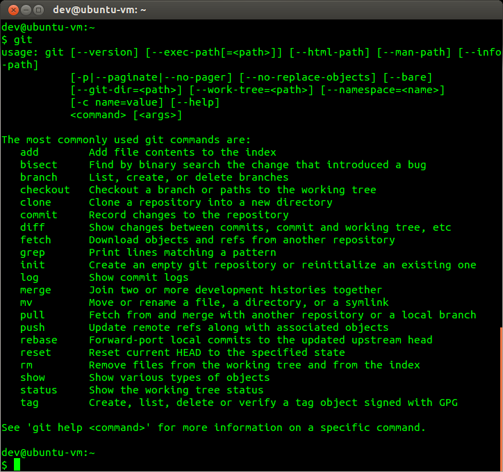

---

### History of git

Developed by Linus Torvalds for the Linux kernel development in 2005 as an replacement for [BitKeeper](http://en.wikipedia.org/wiki/BitKeeper).

- The initial version of git has been written by Torvalds in two weeks.
- Created out of necessity and frustration about the existing source code control sytems (such as CVS).

There is a good Google Tech Talk with Linus Torvalds where he talks about the history and motivation behind git:

<iframe width="420" height="315" src="http://www.youtube.com/embed/4XpnKHJAok8" frameborder="0" allowfullscreen></iframe>

---

### git today

- The git code is publicly available is tracked with ... git (available at [github.com/git](http://github.com/git/git/))
- The code is activly maintained by > 50 developers
- In 2012 git has been used by 27% of all professional software developers (see: [Eclipse Foundation Survey](http://en.wikipedia.org/wiki/Git_(software)#Adoption))
- Github one of the largest git hosters has reached [3 milliion users](https://github.com/blog/1382-three-million-users) in Januar 2013.

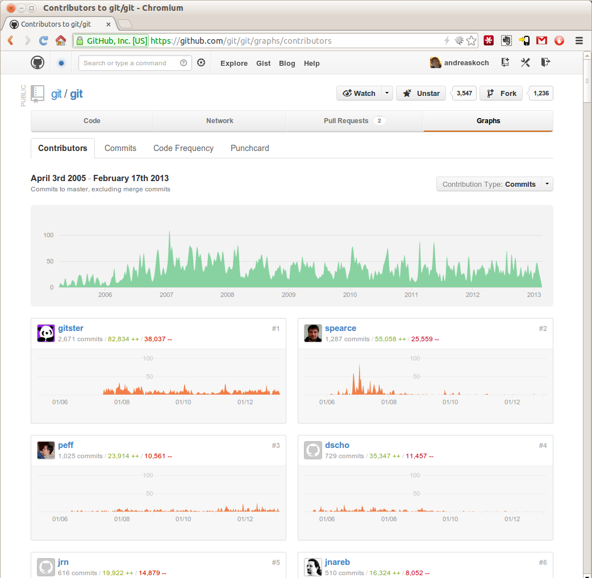

---

### Why the name "git"?

git := British slang meaning "a rotten person"

> I’m an egotistical bastard, and I name all my projects after myself. First Linux, now git.”
> - Linus Torvals

---

### Key features of git

- Git does not track single files but a whole filesystem/folder structure by its content
- Git is distributed without a central server
- Every repository contains the complete history
- Git is optimized for rapid branching and merging
- Easy synchronization with other repositories over existing protocols such as http, ftp, rsync or ssh

---

### Distributed Version Control

> Being distributed very much means that you do not have one central
> location that keeps track of your data. No single place is more
> important than any other single place.
> - Linus Torvals

- no central server
- no central repository
- no special permission

---

### Distributed development workflows

git supports all kinds of developement workflows and branching strategries (because of its distributed nature):

**Subversion-Style workflow**

One central repository where one or more developers pull from and commit to:

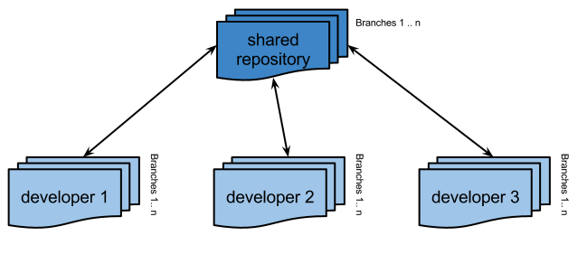

**Integration Manager Workflow**

One single person (the "integration manager") pulls changes from different sources/developers, combines them in his or her repository and pushes the combined commits to a central "blessed" repository:

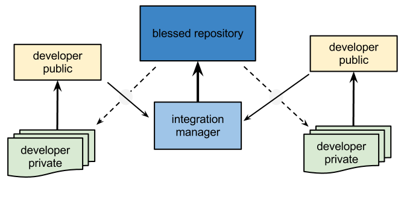

**Dictator and Lieutenants Workflow**

In this **network of trust** a "dictator" pulls from the repositories of her or her trusted "lieutenants" which on their side pull from their trusted developers. The dictator integrates the changes from the lieutenants and then pushes to a central blessed repository.

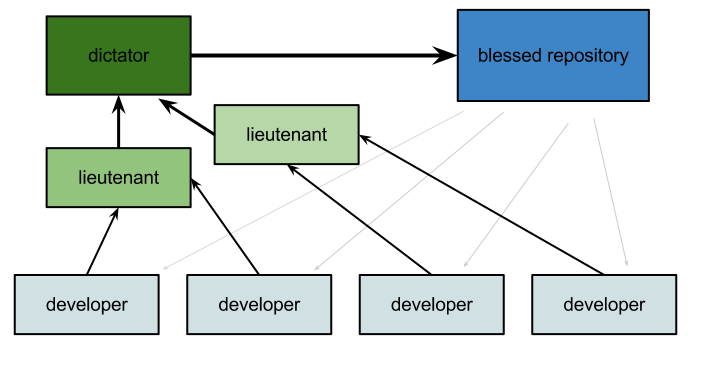

source: http://git-scm.com/about/distributed

---

### How does git cover the things you expect from a SCM?

**Experimenting without loosing changes**

- Git allows you to have multiple experimentation or feature branches which do not interfere with the master branch.
- You can keep your experiments for yourself - your co-workers don't need to know about your experiments if you don't want to
- You can switch between branches very quickly

**Documentation**

- Git encourages developers to commit early and often

**Backup**

- Every developer has a full-copy of the repository
- Every repository contains the full history
- Just copy to the repository folder to another location and you are done

**Collaboration**

- Every developer can work on his or her own branch
- Easy exchange of commits
- Branches and even single commits can be easily exchanged and merged

**No overhead**

- All git needs is a ".git" folder in your repository
- Git does not hold file-locks
- Developers don't have do asks for permission before editing a file
- You don't need special infrastructure to exchange commits - all you need is HTTP or SSH

---

### What distinguishes git from centralized SCMs ...

... such as Team Foundation Server or SVN (Apache Subversion):

- no need for a server
- no central database
- no need for permission management
- no special infrastructure
- no need to be afraid of branching and merging

---

### Why do I think we could benefit from using git ?

With our centralized version control system branching and merging is so painful for us that we hardly do it.

A **healthy branching strategy** would look something like this:
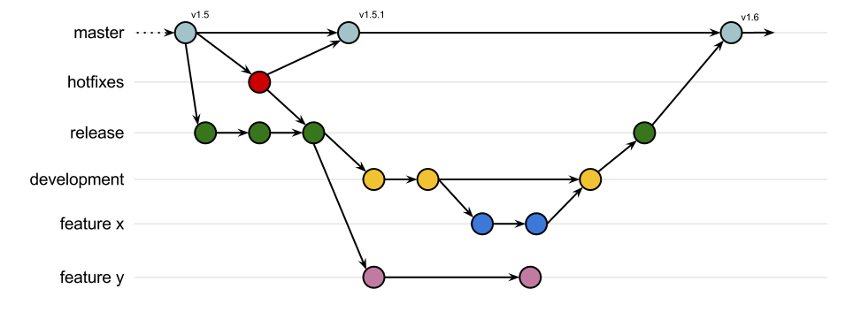

But opposed to that, this is how our unhealthy branching "strategy" looks like ... because branching and merging is (considered) hard:

---

### Other distributed version control systems

There are other distributed SCMs out there, but not that many ...

**Mercurial**

- Mercurial is quite similar to git
- Written in Python
- I think the GUI tools for Mercurial are much better than those for git
- Mercurial is not as fast as git (at least this is my experience)

**BitKeeper**

- commercial product
- has been used by for the kernel development until 2005

**Bazaar**

- developed by Canonical
- written in Python

**Monotone**

- git is influenced by Monotone
- is not as widely used as Mercurial or Bazaar

---

## Basics

- SSH Authentication
- How git works

---

## Terminology

- Working Tree
- Commit
- Branch and tags
- Index
- Stash
- .gitignore

---

## Setting up git on Windows

- Installation
- Configuration
	- Username, Email
	- Merge Tools

---

## Installation on Windows

---

### Installation Wizard

For the installation of git goto [http://git-scm.com](http://git-scm.com) and download the latest version for Windows and execute the installer.

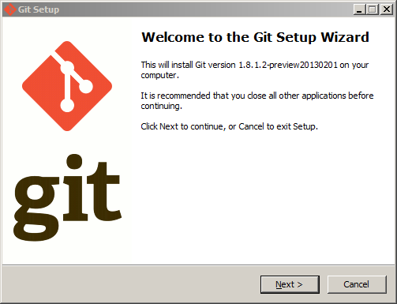

---

### Installation Wizard - Components

In the "Select Components" dialog I suggest that you **uncheck**

- Additional icons and
- Windows Explorer Integration

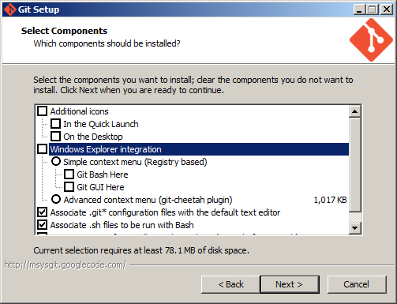

---

### Installation Wizard - PATH Variable

The installation wizard asks you how it should integrate with your system. Please check "Run Git from the Windows Command Prompt". This will make the "git.exe" avaiable from everywhere in your system.

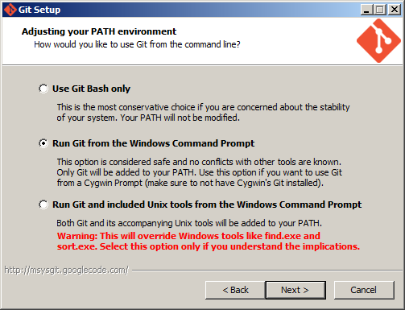

---

### Installation Wizard - Line Ending Conversion

Because git comes from a Unix background, git uses Unix-style instead of Windows-style line-endings.
You should select the "Checkout Windows-style, commit Unix-style line endings" option.

**Windows-style line ending**

Windows uses a carriage return charachter and a line feed character for its line endings:

`"\r\n"`

**Unix-style line ending**

Unix just uses a single line feed charachter for indicating new lines:

`"\n"`

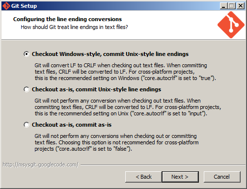

---

### Installation - bin folder

The git intaller installs a bunch of Windows-compatible Linux commands.

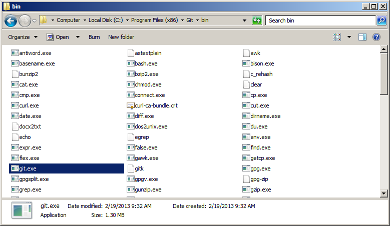

---

### Installation - cmd folder

The cmd-folder contains the git.exe and a script which sets the PATH to the bin folder and then launches a new command prompt.

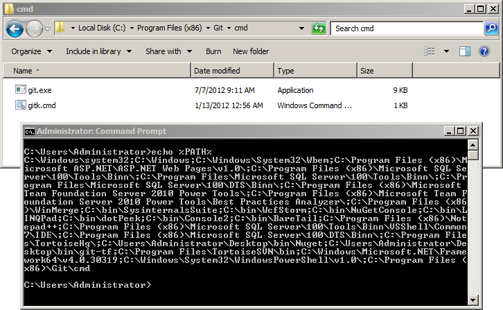

---

### Testing the installation

When the installation was successful when you can execute "git.exe" from all locations on your system:

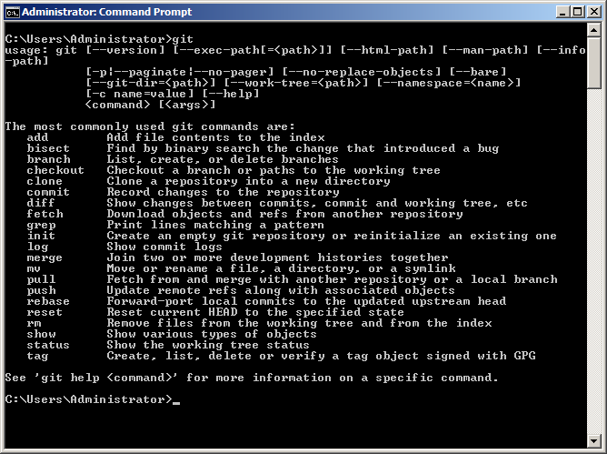

---

## Configuration

---

### Configuration: Username and Email

---

#### Global Config File (.gitconfig)

The global git configuration is located in a file called .gitconfig in your home directory

	> %UserProfile%\.gitconfig

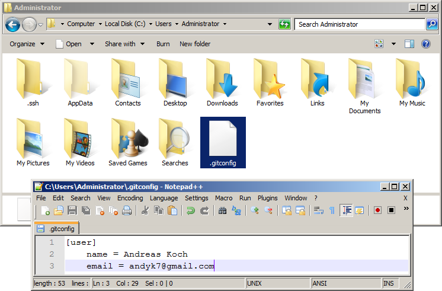

---

#### Set Username and Email

In order to set your Username and Email adress for future commits you can either edit the "%UserProfile%\.gitconfig" file in an editor of your choice or use git config command with the `--global` flag:

<!-- language: lang-sh -->

	> git config --global user.name "Your Name"
	> git config --global user.email "andyk7@gmail.com"

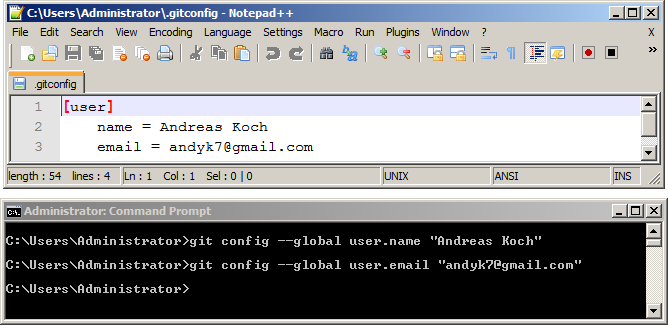

---

### Configuration: Merge and Diff Tool

By default git does not ship with much GUI tools and everything is handled in the command-line:

But you can configure git to use other diff and merge tools (but this isn't that easy on Windows if you don't use tools which are supported out of the box).

---

### Configuring KDiff3 on Windows

I couldn't get my perferred merging tool [WinMerge](http://winmerge.org/) to work with git on Windows, but [KDiff3](http://kdiff3.sourceforge.net/) is also quite nice and can be easily configured to work with git.

**Step 1 - Download and install KDiff3**

http://kdiff3.sourceforge.net

**Step 2 - Extend your .gitconfig**

	[merge]
		tool = kdiff3
	
	[mergetool]
		prompt = false
	
	[mergetool "kdiff3"]
		prompt = false
		path = c:/Program Files (x86)/KDiff3/kdiff3.exe
	
	[diff]
		tool = kdiff3
		guitool = kdiff3
	
	[difftool]
		prompt = false
	
	[difftool "kdiff3"]
		path = c:/Program Files (x86)/KDiff3/kdiff3.exe

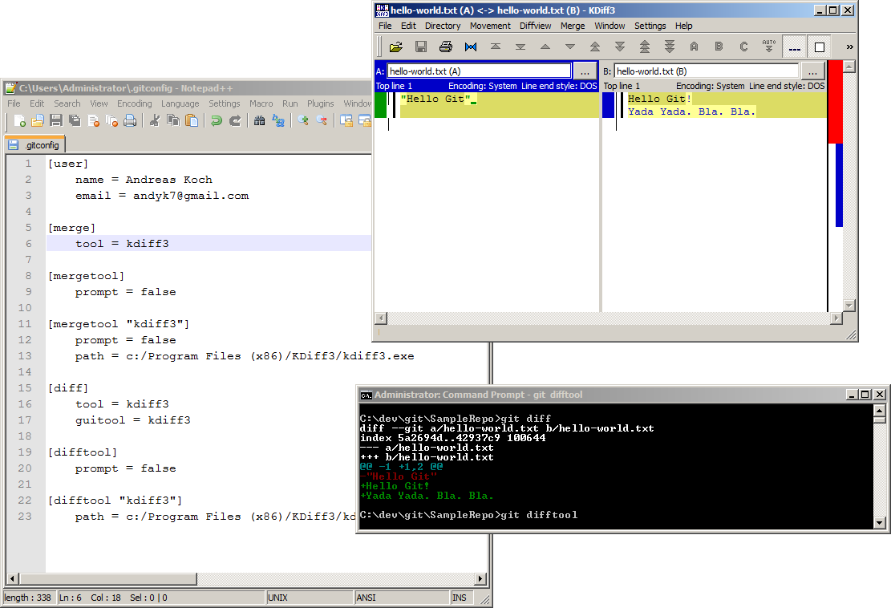

It is supposed to be easy to integrate any other merge tool with git. And it is - at least on Unix based systems. But on Windows I haven't found a way yet.

---

## Working with git

---

### Typical workflows with git

- Creating a repository
- Getting help
- Cloning a repository
- Comparing Commits
- Working with .gitignore files
	- Tracking a .NET project
- Rebasing a single commit on top of another (Cherry Picking)
	- http://stackoverflow.com/questions/1191282/git-diff-commits-difference
- Creating a branch
- Committing changes
- Undoing commits
- Reverting changes
- Merging conflicts
- Merging branches
- Pushing changes to a remote location
- Rewriting history
- Rebasing Repositories
- Managing identities

---

### Creating a repository - git init

You can initialize a repository in any directory by using the **init** command:

<!-- language: lang-sh -->

	> git init

The init command then creates a hidden subdirectory named ".git" that contains all necessary repository meta-data.

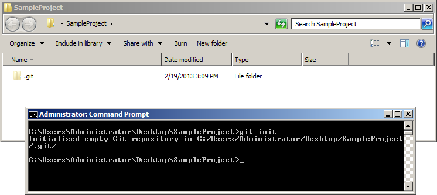

---

### The .git metadata folder

The .git folder is where all you commits, branches and tags will be stored, but for now you don't need to bother with the contents of this folder:

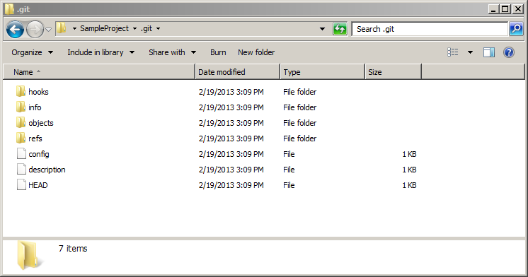

---

### Checking the status of your repository with git status

You can quickly check which the status of files in your repository/index by using the **status** command:

<!-- language: lang-sh -->

	> git status

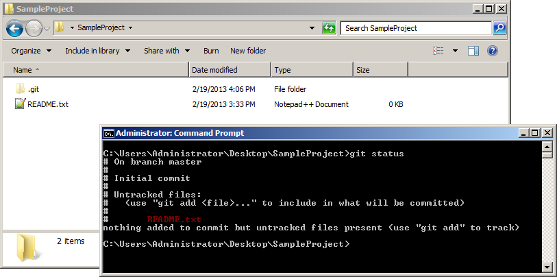

---

### Adding files to the index

Once you have initialized a repository you can create, modify files and add the new files to the **index / staging area**.

**Add one or more files to the index**

<!-- language: lang-sh -->

	> git add <filename1> <filename2>

	> git add .
	Add all files (in the current directory) to the index

**Index / Staging Area**

The index aka "staging area" is a file that contains the files that will go into your next **commit**.

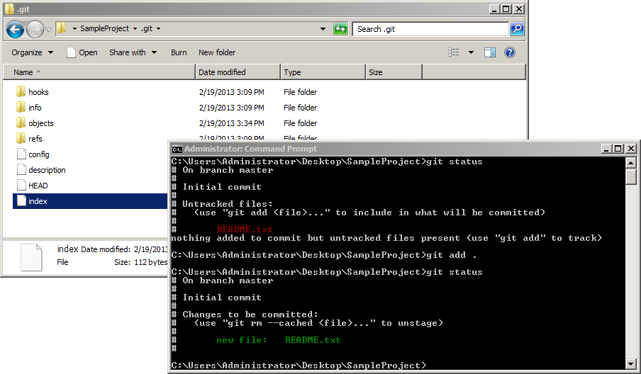

---

### Removing files from the index

You can remove files from the staging area if you have added it accidentally. This means will will not go in your next commit, but the file itself will remain untouched in the folder.

<!-- language: lang-sh -->

	> git rm --cached <filename>

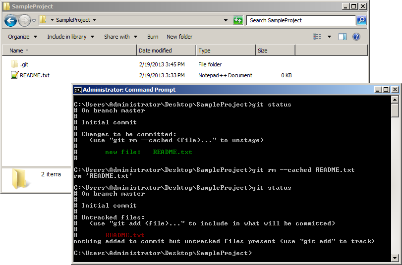

---

### Commiting changes

By commiting you can save all staged files to your (local) repository.

<!-- language: lang-sh -->

	> git commit -m "A first commit"

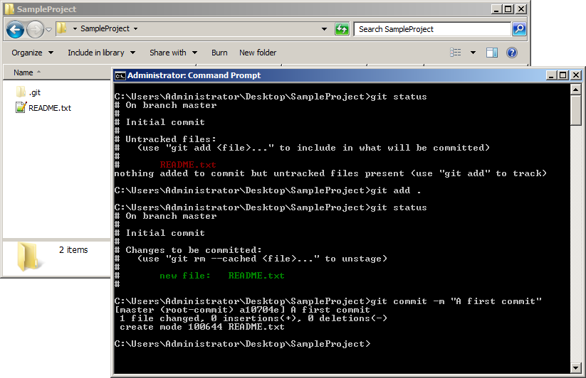

Once you have executed the commit, all changes are recorded to your repository.

---

### Undoing your last commit

If you have accidentally committed a change you can undo your change by using the "reset" command:

On Windows:
<!-- language: lang-sh -->

	> git reset --soft HEAD~1
	
On Linux:
<!-- language: lang-sh -->

	> git reset --soft HEAD^

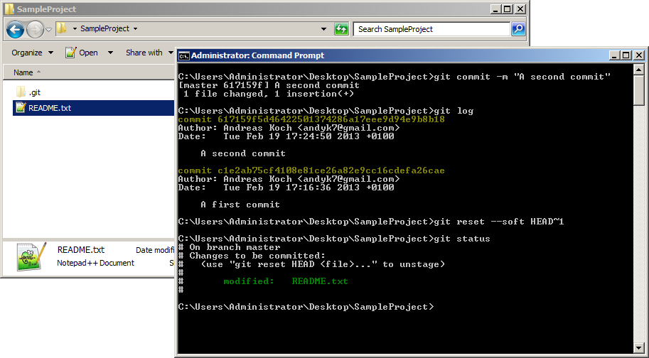

Note: this does not work for your first commit ;-)

---

### Hosting

- Bitbucket/Github
- Self-Hosting

---

## Useful Resources

---

### Official git website

[Official git website at git-scm.com](http://git-scm.com/)

---

###  Interactive Online Tutorial

Github has created a fun online course for learning git:

http://try.github.com

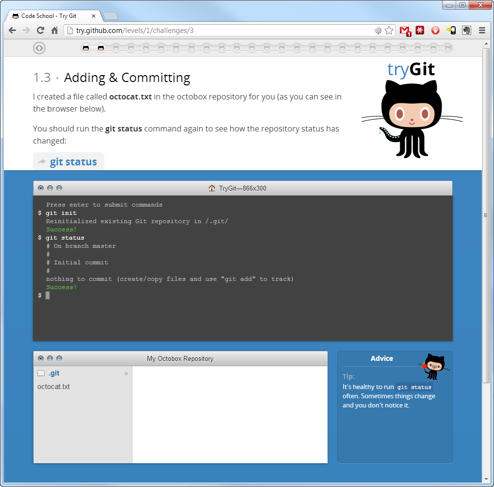

---

### Pro Git eBook

The "Pro Git" eBook is available for free on the git website.

[Pro Git Online](http://git-scm.com/book) / [Pro Git PDF](https://github.s3.amazonaws.com/media/progit.en.pdf)

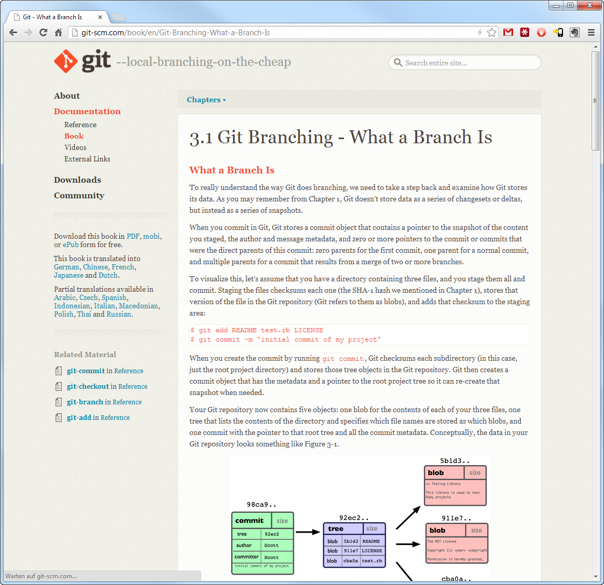

---

### Videos

- [Google Tech Talk: Linus Torvals on git](http://www.youtube.com/watch?v=4XpnKHJAok8)
- [Git Basics Videos](http://git-scm.com/videos)
- [Tekpub: Mastering Git](http://tekpub.com/productions/git)
- [Pluralsight: Git Fundamentals](http://pluralsight.com/training/courses/TableOfContents?courseName=git-fundamentals)

---

### Other Resources

- [Git for cowards](http://www.adoptioncurve.net/wp-content/uploads/2011/05/Git-For-Cowards.pdf)
- [Intro to Git for Web Designers](http://www.webdesignerdepot.com/2009/03/intro-to-git-for-web-designers/)
- [Git Cheat Sheet](http://byte.kde.org/~zrusin/git/git-cheat-sheet.svg)
- [Git Reference](http://gitref.org)

---

language: en-US
date: 2013-02-15
tags: Source Code Management, git